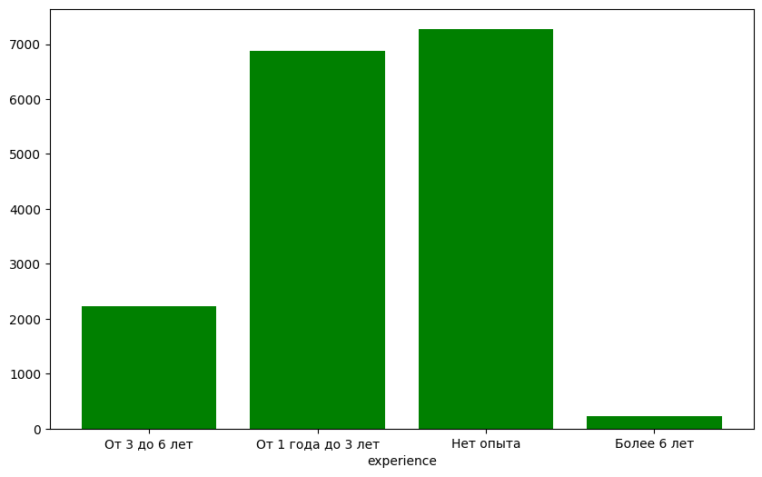
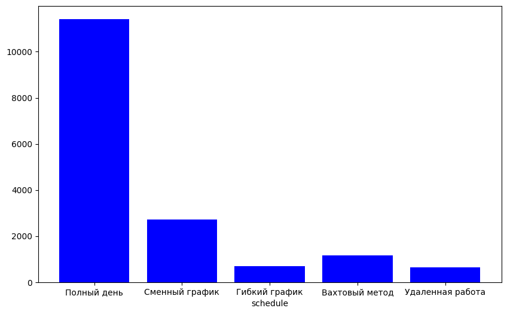
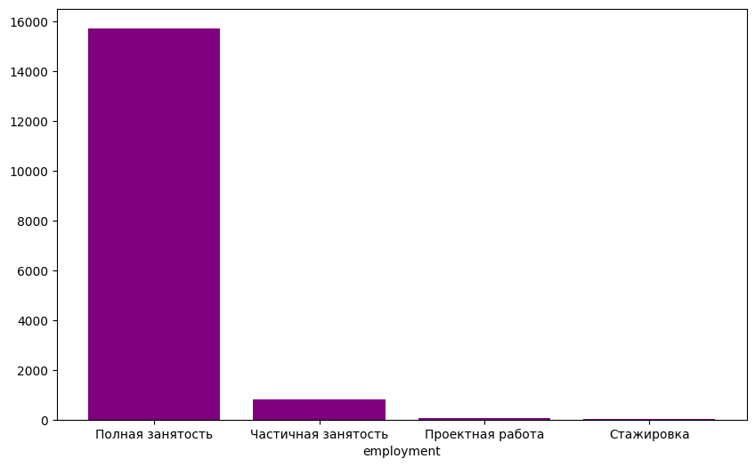
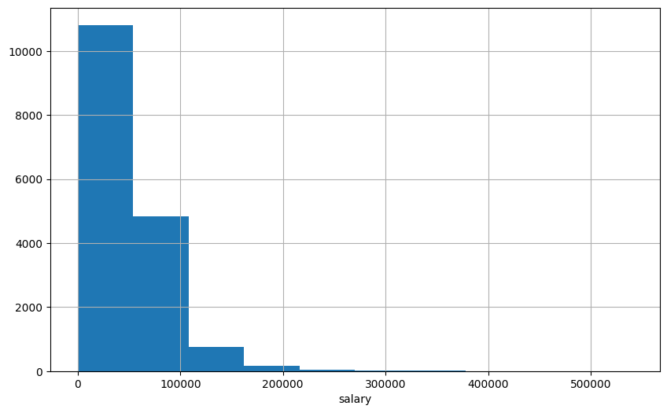

# Предсказание зарплаты по описанию вакансии

## Задача
В рамках настоящего соревнования вам предлагается решить задачу предсказания зарплаты по описанию вакансии. Соревнование проходит в рамках буткемпа "Second Step In NLP", проводимого онлайн-магистратурой "Машинное обучение и высоконагруженные системы", ФКН ВШЭ.

## Данные
- Опыт работы   
   
- Расписание   
   
- Вид занятости   
   
- Распределение зарплаты   

## Решение
Для решения сначала я чистил текст с помощью библиотеки nltk.  
После этого я решил использовать word2vec для векторного представления слов и на этих данных обучить ансамбль бустингов: CatBoost, LightGBM, XGBoost.

## Результат
Данное решение на приватном лидерборде по метрике R2 набрало 0.43.